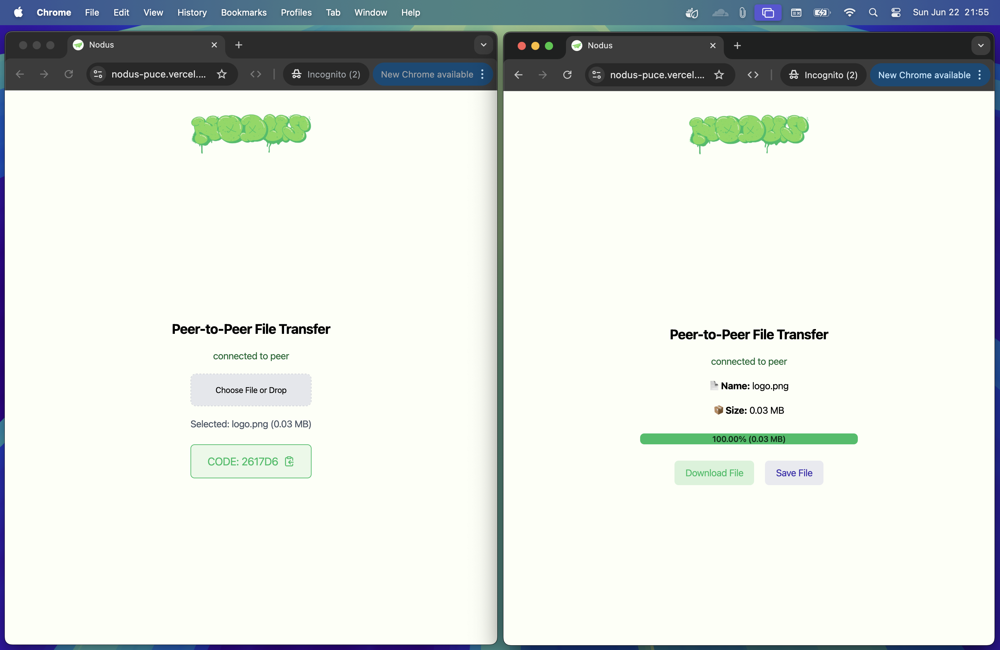
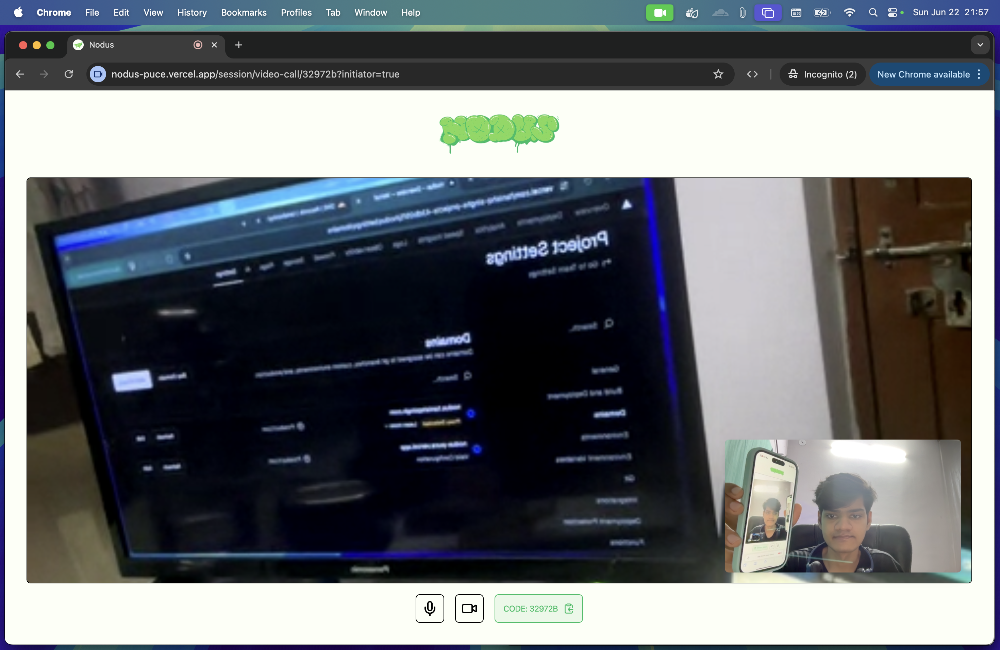

<h1 align="center">NODUS</h1>

check out it's live: [**nodus.tanishqsingh.com**](https://nodus.tanishqsingh.com)

- In latin _nodus_ means **knot**, mesh of peers tight like knot.
- Simple _**peer to peer**_

    1. video calling
    2. file sharing

### Read before use
- this uses webrtc internally so you **can't use vpn**,
- and if you are a tester then please open both tabs in **incognito**,
- otherwise it will not work [why this happens?](https://github.com/feross/simple-peer/issues/732)

<h2 align="center">Example Images</h2>

#### 1. File Share

#### 2. Video Call

